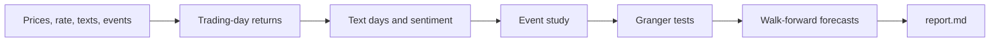
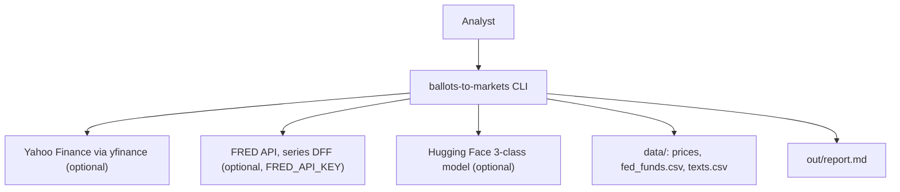
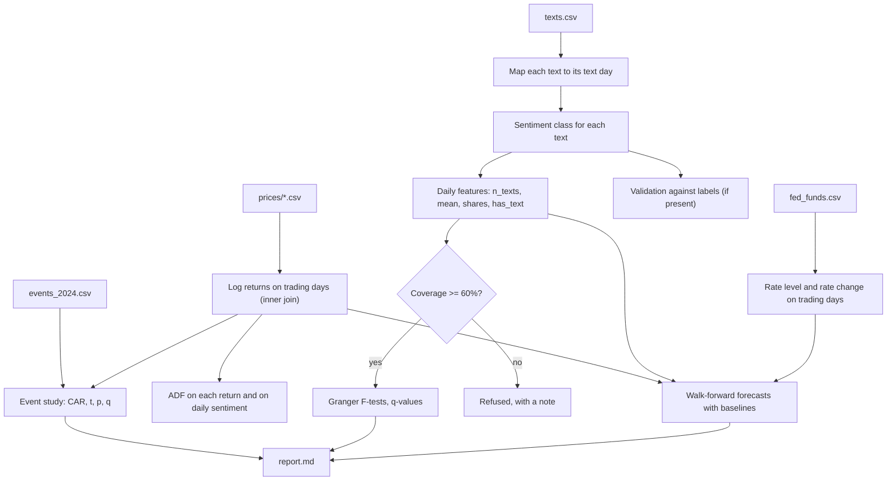

<div align="center">

# ballots-to-markets — Election Sentiment, Fed Policy and Market Moves

**ballots-to-markets is a reproducible study pipeline for analysts who ask whether election news and Fed decisions move U.S. markets. It takes prices, the policy rate and dated texts through these steps to tested results with baselines:**

`load` → `align to trading days` → `score sentiment` → `event study` → `causality tests` → `walk-forward forecasts` → `report`.


**[Summary](#1-summary)** ·
**[Workflow](#4-the-end-to-end-workflow)** ·
**[Run it](#14-how-to-run-ballots-to-markets)** ·
**[Configuration](#144-environment-variables)** ·
**[Known problems](#17-known-problems)** ·
**[Glossary](#19-glossary)**

</div>

> [!NOTE]
> This README uses ASD-STE100 Simplified Technical English. The writing rules and the project
> vocabulary are in [`docs/ste-style-guide.md`](docs/ste-style-guide.md). Each term in the
> [Glossary](#19-glossary) has only one meaning.

> [!WARNING]
> Do not use the results to make investment decisions. ballots-to-markets is a research tool, not financial advice.
> A test result on one election period does not predict the next one.

---

ballots-to-markets studies three questions about the 2024 U.S. election period: do events move prices, does text sentiment lead returns, and can a model forecast the next day better than a baseline?
The pipeline works only on real trading days. It never fills a weekend, a holiday or a day with no text by interpolation.
The event study is the primary analysis. Granger tests and forecasts are secondary, and each forecast is compared with the zero and historical-mean baselines.
All tests correct for multiple testing with Benjamini-Hochberg q-values.
The offline demo uses synthetic data with planted effects, so you can see that each method finds a known effect and rejects a known null.

This README is the **one location that explains all of ballots-to-markets**. It gives these topics:

- the general design
- each component and its procedure, step by step
- the decision rules
- the data map
- the runbook
- the validation results and the known problems

| If you are… | Read |
|---|---|
| A manager or reviewer | [1](#1-summary), [3](#3-design-rules), [4](#4-the-end-to-end-workflow), [16](#16-validation-results), [18](#18-key-points) |
| A developer who joins the project | All sections, in sequence. Keep [14](#14-how-to-run-ballots-to-markets) and [17](#17-known-problems) open while you work |
| An analyst who runs ballots-to-markets | [14](#14-how-to-run-ballots-to-markets), then the section for the analysis that you use |

---

## Table of contents

1. 🧭 [Summary](#1-summary)
2. 🏗️ [How ballots-to-markets is built](#2-how-ballots-to-markets-is-built)
   - 2.1 [Components](#21-components)
   - 2.2 [System context](#22-system-context)
   - 2.3 [Repository layout](#23-repository-layout)
3. 🛡️ [Design rules](#3-design-rules)
4. 🔄 [The end-to-end workflow](#4-the-end-to-end-workflow)
   - 4.1 [Full flow](#41-full-flow)
   - 4.2 [The life cycle of one text](#42-the-life-cycle-of-one-text)
5. 📥 [The loaders and the fetchers](#5-the-loaders-and-the-fetchers)
6. 📅 [The trading-day alignment](#6-the-trading-day-alignment)
7. 💬 [The sentiment models](#7-the-sentiment-models)
8. 🔵 [The event study](#8-the-event-study)
9. 🟢 [The causality tests](#9-the-causality-tests)
10. 🟣 [The walk-forward forecasts](#10-the-walk-forward-forecasts)
11. ⚖️ [The decision rules](#11-the-decision-rules)
12. 📝 [The report](#12-the-report)
13. 🗂️ [Data and file map](#13-data-and-file-map)
14. ▶️ [How to run ballots-to-markets](#14-how-to-run-ballots-to-markets)
    - 14.1 [Prerequisites](#141-prerequisites) · 14.2 [Installation](#142-installation) · 14.3 [Run ballots-to-markets](#143-run-ballots-to-markets) · 14.4 [Environment variables](#144-environment-variables)
15. 🧩 [How to extend ballots-to-markets](#15-how-to-extend-ballots-to-markets)
16. ✅ [Validation results](#16-validation-results)
17. ⚠️ [Known problems](#17-known-problems)
18. 📌 [Key points](#18-key-points)
19. 📖 [Glossary](#19-glossary)
20. 📄 [License](#20-license)

---

## 1. Summary

**The problem.** Election news, Fed decisions and market prices all move in the same months. These questions are difficult:

- How do you measure the effect of one event when markets move every day?
- How do you combine texts from weekends and evenings with prices from trading days?
- How do you test a lead from sentiment to returns without invented data?
- How do you know that a forecast model is better than a guess of zero?

ballots-to-markets gives each of these questions its own component. Each component has unit tests.

| Item | Value |
|---|---|
| Input | Daily close prices of 5 assets, the FRED policy rate, dated texts, an event calendar |
| Output | Event-study tables, ADF and Granger tables with q-values, forecast scores against baselines, `report.md` |
| Components | **14** modules (config, data, fetch, market, textdays, sentiment, event_study, causality, forecast, lstm, pipeline, report, synthetic, cli) and the event calendar |
| Providers | Yahoo Finance (extra `fetch`), FRED API (`FRED_API_KEY`), a Hugging Face 3-class model (extra `nlp`), all optional |
| Offline mode | Synthetic prices, rate and texts with planted effects, and the lexicon sentiment model |
| Safety | No interpolation of prices or text, train-only fits, q-values, a coverage limit for text tests |
| Tests | **27** unit tests pass (`pytest`). 1 test needs statsmodels. CI also skips the LSTM test |



---

## 2. How ballots-to-markets is built

### 2.1 Components

| Component | Module | Purpose |
|---|---|---|
| Settings | `src/ballots_to_markets/config.py` | `Settings` from `B2M_*` variables, masked FRED key |
| Loaders | `src/ballots_to_markets/data.py` | Price, rate, text and event loaders with schema checks |
| Fetchers | `src/ballots_to_markets/fetch.py` | yfinance and FRED downloads with a file cache |
| Market panel | `src/ballots_to_markets/market.py` | Log returns on trading days, rate changes, flat-column check |
| Text days | `src/ballots_to_markets/textdays.py` | Text-to-trading-day map, daily features, coverage |
| Sentiment | `src/ballots_to_markets/sentiment.py` | `LexiconSentiment`, `HFSentiment` (3-class only), validation |
| Event study | `src/ballots_to_markets/event_study.py` | Market model, CAR, t-tests, CAAR by kind, Benjamini-Hochberg |
| Causality | `src/ballots_to_markets/causality.py` | ADF with MacKinnon p-values, Granger F-tests, VAR with AIC |
| Forecasts | `src/ballots_to_markets/forecast.py` | Feature design, baselines, models, walk-forward test, Diebold-Mariano |
| LSTM | `src/ballots_to_markets/lstm.py` | Optional PyTorch LSTM with early stopping |
| Pipeline | `src/ballots_to_markets/pipeline.py` | `load_study`, `event_study`, `causality`, `forecasts` |
| Report | `src/ballots_to_markets/report.py` | `report.md` from the computed tables |
| Synthetic data | `src/ballots_to_markets/synthetic.py` | Prices, rate and texts with planted effects |
| CLI | `src/ballots_to_markets/cli.py` | The `ballots-to-markets` command with 8 subcommands |
| Event calendar | `src/ballots_to_markets/data/events_2024.csv` | 16 election and FOMC events |

### 2.2 System context



### 2.3 Repository layout

```
ballots-to-markets/
├── .github/workflows/ci.yml       # CI: Python 3.11, pip install -e ".[dev]", pytest -q
├── .env.example                   # all 10 variables, empty
├── pyproject.toml                 # package, extras (fetch, nlp, deep, stats, dev), CLI script
├── data/README.md                 # layout, sources, terms
├── docs/ste-style-guide.md        # writing rules and project vocabulary
├── src/ballots_to_markets/
│   ├── config.py  data.py  fetch.py           # settings, loaders, downloads
│   ├── market.py  textdays.py  sentiment.py   # returns, text days, sentiment
│   ├── event_study.py  causality.py           # events, ADF, Granger, VAR
│   ├── forecast.py  lstm.py                   # walk-forward forecasts
│   ├── pipeline.py  report.py  synthetic.py  cli.py
│   └── data/events_2024.csv                   # built-in event calendar
└── tests/                                     # 28 tests (27 run here, 1 needs statsmodels)
```

---

## 3. Design rules

### 3.1 Only trading days
`market.log_returns` calculates each return between two consecutive trading days of that asset. The panel keeps the days on which all assets traded. No price is interpolated and no weekend row exists.

### 3.2 No invented text values
A text goes to the first trading day on which the market can react. A trading day with no text has `n_texts = 0` and a NaN sentiment. The Granger test drops these rows. Only the forecast features fill them with 0, together with a `has_text` flag.

### 3.3 Text tests need coverage
If fewer than 60% of the trading days have text, `causality` refuses the Granger tests on text and the report says why.

### 3.4 Three sentiment classes
`HFSentiment` refuses a model without a `neutral` label. The validation gives the recall of each class, so a model that never predicts `neutral` is visible.

### 3.5 Each fit sees only the past
The walk-forward test refits at each block on the rows before the block. Scalers are pipeline steps, so they are fit on the same rows. A test checks this with a spy model.

### 3.6 Each forecast has a baseline
Each forecast table contains `zero` and `hist_mean`. The out-of-sample R² is relative to `hist_mean`. A Diebold-Mariano test compares each model with `zero`.

### 3.7 Multiple tests are corrected
The event study and the Granger table give Benjamini-Hochberg q-values over all their tests.

---

## 4. The end-to-end workflow

### 4.1 Full flow



### 4.2 The life cycle of one text

1. The loader reads the text, its timestamp and its optional label.
2. A naive timestamp is local time in `B2M_TEXT_TIMEZONE` (New York).
3. If the time is at or after 16:00, the text moves to the next calendar day.
4. The text goes to the first trading day at or after that day.
5. The sentiment model gives the text a class.
6. The daily features count the texts and average their class scores.
7. The Granger test uses the daily mean. The forecasts use all daily features.

---

## 5. The loaders and the fetchers

| Loader | File | Checks |
|---|---|---|
| `load_prices_csv` | `Date,Close` | Columns present, no duplicate date, close price above 0 |
| `load_rate_csv` | `date,value` or `observation_date,<SERIES>` | Value is a number. FRED `.` values are dropped |
| `load_text_csv` | `timestamp`, `tweet_text`, optional `sentiment`, `candidate` | Columns present, bad timestamps and empty texts dropped |
| `load_events` | `date,name,kind[,source]` | Columns present, sorted by date |

**Procedure of `ballots-to-markets fetch`**

1. For each asset, if `data/prices/<asset>.csv` does not exist (or `--refresh` is set), download the daily prices with yfinance.
2. If `data/fed_funds.csv` does not exist, download the FRED series `DFF` with `FRED_API_KEY`.
3. Keep the files as a cache for the next run.

---

## 6. The trading-day alignment

| Rule | Value |
|---|---|
| Return | `log(close_t / close_previous trading day)` of each asset |
| Panel days | Days with a return for all 5 assets |
| Text day | First trading day at or after the text date. At or after 16:00 counts as the next day |
| Ambiguous autumn hour | Counted as standard time |
| Policy rate | Last known value on each trading day, its change and a change-day flag |
| Flat column | A column with fewer than 5 distinct values is flagged. The rate level is flagged and not used |

---

## 7. The sentiment models

| Model | Setting | Classes | Needs |
|---|---|---|---|
| `lexicon` | `B2M_SENTIMENT_MODEL=lexicon` (default) | negative, neutral, positive | Nothing |
| Hugging Face | `B2M_SENTIMENT_MODEL=cardiffnlp/twitter-roberta-base-sentiment-latest` | negative, neutral, positive | Extra `nlp`, a download |

**Procedure of the lexicon model**

1. Lower-case the text and split it into words.
2. Add +1 for each positive word and −1 for each negative word.
3. If one of the 3 words before a sentiment word is a negator (`not`, `no`, `never`, `n't`, `cannot`, `hardly`), change the sign.
4. Divide the sum by the square root of the word count.
5. A score above 0 is `positive`, below 0 is `negative`, and 0 is `neutral`.

`ballots-to-markets sentiment` gives the accuracy, the macro F1, the recall of each class and the confusion matrix.

---

## 8. The event study

**Purpose.** Measure the abnormal return around each event.

**Procedure**

1. Find day 0: the first trading day at or after the event date.
2. Take the estimation window: 120 trading days that end 10 days before the event window.
3. If the estimation window has fewer than 60 days, skip the event.
4. Fit the normal-return model. Use the market model for each asset and the constant mean for `sp500`.
5. Calculate the abnormal return of each day from −1 to +1.
6. CAR = sum of the abnormal returns. t = CAR / (σ × √3). The p-value uses the t distribution.
7. Calculate the q-values over all events and assets.
8. For each event kind and asset, calculate the mean CAR (CAAR) and a t-test across events.

`--window-start` and `--window-end` change the event window.

---

## 9. The causality tests

| Test | Method | Output |
|---|---|---|
| ADF | Regression of Δy on a constant, y(t−1) and k lags of Δy. k from AIC, at most 12 × (n/100)^0.25 | t-statistic, MacKinnon p-value, k, observations |
| Granger | OLS with and without the lags of the cause. F = ((RSS_r − RSS_u)/p) / (RSS_u/(n − 2p − 1)) | F, p, q, observations, for lags 1, 2, 3, 5 |
| VAR | OLS of all series on their lags. Lag from AIC (1 to 5) | Coefficients, one-step forecast |

The ADF, Granger and VAR code uses NumPy and SciPy only. A test compares it with statsmodels when the `stats` extra is installed. On the cross-check data, the statistics are equal.

---

## 10. The walk-forward forecasts

**Purpose.** Forecast the return of the next trading day, and compare each model with the baselines.

| Model | What it is |
|---|---|
| `zero` | Always 0 |
| `hist_mean` | Mean of all training targets |
| `ar` | Linear regression on the 3 own lags of the target |
| `ridge` | Scaler + ridge regression (α = 10) on all lags, text features and the rate change |
| `gbr` | Histogram gradient boosting (depth 3, rate 0.05, 200 rounds, early stopping) |
| `lstm` | LSTM (16 units, 10-day window, early stopping on the last 15% of the training rows). Extra `deep` |

**Procedure**

1. Make the features of day t: 3 lags of each return, the daily text features and the rate change.
2. Make the target: the return of the target asset on day t+1.
3. Use the first 60% of the rows as the first training set.
4. For each block of 20 rows, fit each model on all earlier rows and forecast the block.
5. Calculate RMSE, MAE, R² relative to `hist_mean`, direction accuracy and the Diebold-Mariano test against `zero`.

---

## 11. The decision rules

| Rule | Value | Module |
|---|---|---|
| Minimum text coverage for Granger tests | 0.6 (`B2M_MIN_TEXT_COVERAGE`) | `pipeline.py` |
| Market close | 16:00 New York time | `textdays.py` |
| Event window | −1 to +1 trading days | `event_study.py` |
| Estimation window | 120 days, gap 10, minimum 60 | `event_study.py` |
| Granger lags | 1, 2, 3, 5 | `pipeline.py` |
| VAR maximum lag | 5 | `causality.py` |
| Flat-column limit | fewer than 5 distinct values | `market.py` |
| Walk-forward start, block | 60% of the rows, 20 rows | `forecast.py` |
| ADF critical values (constant) | 1%: −3.43, 5%: −2.86, 10%: −2.57 | `causality.py` |
| Significance | q < 0.05 | All tables |

---

## 12. The report

`ballots-to-markets report` writes `report.md` with these parts:

1. The data source (synthetic or local files), the trading days, the dropped days and the text coverage.
2. The notes (low coverage, flat rate level).
3. The sentiment validation, if the texts have labels.
4. The event-study table and the CAAR table.
5. The ADF table and the Granger table, or the reason why the Granger table is refused.
6. One forecast table for each target asset.

---

## 13. Data and file map

| Path | Committed? | Contents |
|---|---|---|
| `data/README.md` | Yes | Layout, sources, terms |
| `data/prices/*.csv`, `data/fed_funds.csv` | No (git ignores them) | Downloaded prices and the policy rate |
| `data/texts.csv` | No (git ignores it) | Your texts |
| `data/synthetic/` | No (git ignores it) | Output of `ballots-to-markets synth` |
| `src/ballots_to_markets/data/events_2024.csv` | Yes | The built-in event calendar |
| `out/report.md` | No (git ignores it) | Output of `ballots-to-markets report` |
| `.env.example` | Yes | All 10 variables, empty |
| `.env` | No (git ignores it) | Local settings and `FRED_API_KEY` |

---

## 14. How to run ballots-to-markets

### 14.1 Prerequisites

| Need | For |
|---|---|
| Python 3.11+ | All components |
| `numpy`, `pandas`, `scipy`, `scikit-learn` | All components (installed with the package) |
| `yfinance` (extra `fetch`) and a FRED key | Downloads |
| `transformers`, `torch` (extra `nlp`) | The Hugging Face sentiment model |
| `torch` (extra `deep`) | The LSTM |
| `statsmodels` (extra `stats`) | The cross-check test only |

### 14.2 Installation

```bash
git clone https://github.com/KrishnaAnnavaram/ballots-to-markets.git
cd ballots-to-markets
python -m venv .venv
. .venv/bin/activate            # Windows: .venv\Scripts\activate
pip install -e ".[dev]"         # add ,fetch,nlp,deep for the optional parts
```

### 14.3 Run ballots-to-markets

Offline (synthetic data with planted effects):

```bash
ballots-to-markets sentiment --synthetic
ballots-to-markets events --synthetic
ballots-to-markets causality --synthetic
ballots-to-markets forecast --synthetic --target sp500
ballots-to-markets forecast --synthetic --target gold --models zero,hist_mean,ar,ridge,gbr,lstm
ballots-to-markets report --synthetic --out out
ballots-to-markets synth --out data/synthetic        # the same data as CSV files
```

With real data (see `data/README.md`):

```bash
export FRED_API_KEY=<your key>     # or put it in .env
ballots-to-markets fetch
ballots-to-markets report --texts data/texts.csv --out out
ballots-to-markets report --texts train.csv val.csv test.csv --sentiment-model cardiffnlp/twitter-roberta-base-sentiment-latest
```

### 14.4 Environment variables

| Variable | Used by | Meaning |
|---|---|---|
| `B2M_DATA_DIR` | Loaders, fetch | Data folder. Default `data` |
| `B2M_OUT_DIR` | Report | Default `out` |
| `B2M_START`, `B2M_END` | All | Study period. Default 2023-11-01 to 2025-02-10 |
| `B2M_SEED` | Synthetic data, models | Default 42 |
| `B2M_TEXT_TIMEZONE` | Text days | Time zone of naive timestamps. Default `America/New_York` |
| `B2M_MARKET_CLOSE_HOUR` | Text days | Default 16 |
| `B2M_MIN_TEXT_COVERAGE` | Causality | Default 0.6 |
| `B2M_SENTIMENT_MODEL` | Sentiment | `lexicon` (default) or a 3-class Hugging Face model |
| `FRED_API_KEY` | Fetch | FRED key. Never printed |

Credentials are only in a local `.env` file or the environment. Git ignores `.env`. Do not print or commit credentials.

---

## 15. How to extend ballots-to-markets

| You want to… | Do this | Code change? |
|---|---|---|
| Add events (for example CPI releases) | Write an event CSV and use `--events` | No |
| Use another period | Set `B2M_START` and `B2M_END`, then `fetch --refresh` | No |
| Add an asset | Add a name and a ticker to `ASSETS` in `__init__.py` | Small |
| Add a forecast model | Add a branch to `make_model` and a name to `MODELS` | Small |
| Add stance by candidate | Aggregate by the `group` column in `textdays.py` | Small |
| Add GARCH volatility | Add a model in a new module behind an extra | Yes |

---

## 16. Validation results

| Validation | Result | Command |
|---|---|---|
| Unit tests | **27 passed, 1 skipped** (statsmodels not installed). Expected in CI: 26 passed, 2 skipped (no statsmodels, no torch) | `pytest -q` |
| Cross-check with statsmodels 0.15 | ADF statistic and p-value, Granger F and p, VAR coefficients are equal | `pytest tests/test_analysis.py` with the `stats` extra |
| Synthetic sentiment validation | Accuracy 1.000 on 9,396 texts, recall 1.000 for each class | `ballots-to-markets sentiment --synthetic` |
| Synthetic Granger, planted lead to `sp500` | Lag 1: F = 12.35, p = 0.0005, q = 0.0065 | `ballots-to-markets causality --synthetic` |
| Synthetic Granger, null asset `gold` | Lag 1: F = 0.76, p = 0.384, q = 0.549 | same |
| Synthetic event study, election day, `sp500` | CAR(−1..+1) = 0.023, p = 0.159, q = 0.768 (planted effect 0.025 on day +1) | `ballots-to-markets events --synthetic` |
| Synthetic forecasts, `sp500` (126 forecasts) | R² vs `hist_mean`: `ar` 0.054, `ridge` 0.051, `gbr` −0.015, `zero` 0.005 | `ballots-to-markets forecast --synthetic` |
| Synthetic forecasts, `gold` (126 forecasts) | R² vs `hist_mean`: `ar` −0.037, `ridge` −0.151, `gbr` −0.059, `zero` 0.003 | `ballots-to-markets forecast --synthetic --target gold` |
| Synthetic LSTM, `sp500` | R² vs `hist_mean` 0.013 (about 60 s on a laptop CPU) | `... --models zero,hist_mean,lstm` |

All numbers are from SYNTHETIC data with seed 42 and 318 trading days. They test the methods, not real markets.
The lexicon accuracy of 1.000 is expected, because the synthetic texts use the lexicon words. It says nothing about real posts.
The Granger test finds the planted lead (q = 0.0065) and finds nothing for gold, which has no planted link.
A single election effect of 2.5% is not significant in a 3-day window (p = 0.159). One event of this size is near the noise level, so event studies need several events or larger effects. A test with a planted 6% effect finds it with p < 0.01.
On gold, every model is worse than the zero forecast. This is the expected result when there is no signal.
The prototype reported a negative test R² for every asset (−0.34 to −7.6) without a baseline. That number is a prototype result and is not reproduced here.

---

## 17. Known problems

Read these problems before you use the results.

| # | Area | Problem | Impact and action |
|---|---|---|---|
| 1 | Results | No real-data result is in this README. CI uses only synthetic data | Run `fetch` and `report` on real data and publish the tables with the period |
| 2 | Text data | The prototype text sample covers about 120 days, below the coverage limit | Collect a documented text source with daily coverage |
| 3 | Sentiment | The lexicon is short and was not validated on real posts | Use a 3-class social-media model and validate it on a labelled sample |
| 4 | Power | One event in a 3-day window has low power (see section 16) | Pool events by kind, or use intraday data |
| 5 | Policy rate | The rate changed 3 times in the period. Its level carries no daily information | The models use the change. Use FOMC events for the policy question |
| 6 | Vendor data | Yahoo Finance terms limit redistribution | Do not commit price files |
| 7 | LSTM | The LSTM is slow on a CPU and not tested in CI | Use it only with the `deep` extra and compare it with the baselines |
| 8 | Causality | A Granger result is a statement about prediction, not about cause | Do not report it as a causal effect |

---

## 18. Key points

1. **Only trading days.** No weekend, holiday or text-free day gets an invented value.
2. **The event study comes first.** CAR, t-tests and q-values around each election and FOMC event.
3. **Text tests need coverage.** Below 60% coverage, the Granger tests on text are refused.
4. **Each forecast has a baseline.** R² is relative to the historical mean, and a DM test compares each model with zero.
5. **The methods find planted effects.** On synthetic data, q = 0.0065 for the planted lead. Gold, the null asset, gets q = 0.549.
6. **The full demo runs offline.** 27 tests run with no download and no key.

---

## 19. Glossary

| Term | Meaning |
|---|---|
| **Abnormal return** | The return minus the normal-return model |
| **ADF** | Augmented Dickey-Fuller test of a unit root |
| **Asset** | One of `sp500`, `dow`, `gold`, `wti`, `brent` |
| **Baseline** | The `zero` or `hist_mean` forecast |
| **CAR** | Cumulative abnormal return: the sum of the abnormal returns in the event window |
| **CAAR** | The mean CAR over the events of one kind |
| **Coverage** | The share of trading days with at least one text |
| **Daily sentiment** | The mean class score (−1, 0, +1) of the texts of one trading day |
| **Diebold-Mariano test** | A test of equal squared forecast error of two forecasts |
| **Event day** | The first trading day at or after the event date (day 0) |
| **Granger test** | An F-test of whether past values of one series improve the forecast of another |
| **q-value** | A Benjamini-Hochberg adjusted p-value |
| **Text day** | The trading day to which a text is mapped |
| **Trading day** | A day on which all assets have a close price |
| **Walk-forward test** | Refit on all earlier rows, then forecast the next block |

---

## 20. License

[MIT](LICENSE) © 2026 Krishna Annavaram
